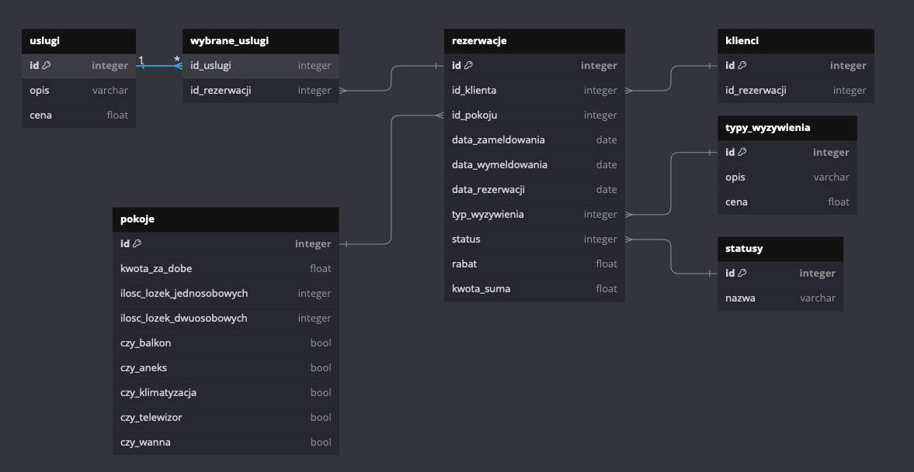

<!-- <style>
 p,li {
    font-size: 12pt;
  }
</style>  -->

<!-- <style>
 pre {
    font-size: 8pt;
  }
</style>  -->


---


**Temat:** Hotel - Rezerwacja Miejsc Noclegowych

**Autorzy:** Wojciech Kwiatkowski, Adam Orzeł, Bartosz Lasoń, Kacper Kaleta, Marcin Marszałek

--- 

# 1.  Zakres i krótki opis systemu


Celem projektu jest stworzenie systemu umożliwiającego ewidencjonowanie i zarządzanie rezerwacjami pokoi hotelowych.

Hotel oferuje pokoje na wynajem.
Pokoje są jedno, dwu, trzy-cztero osobowe.
Oferują różny stopień wyposażenia: balkon (możliwość palenia papierosów), aneks, klimatyzacja, telewizor, wanna lub prysznic.
Rezerwacja może zostać poszerzona o dodatkowe usługi: sauna i/lub wypożyczenie rowerów.
Hotel oferuje trzy standardy wyżywienia: śniadanie, obiadokolacja + śniadanie, all inclusive.

Zakres wynajmu wynosi od 1 doby do maksymalnie 2 tygodni.
Rezerwacja musi zostac dokonana minimum na 48h przed zameldowaniem, aby system mógł zatwierdzić rezerwacje klienta.
W czasie rezerwacji system będzie sprawdzał czy dany pokój jest dostępny, jeśli nie to czy jest wolny podobny pokój o szukanych wymaganiach. Jeśli klient zdecyduje się przedłużyc okres wynajmu, system sprawdza czy konkretny pokój nie został uwcześnie zarezerwowany przez innego klienta w danym terminie.

---

*Informacje dla nas na podstawie których będziemy tworzyć rezerwacje w bazie danych.*

**Cenna bazowa za rozmiar pokoju**:
- jednoosobowe 150 zł
- dwuosobowe 220 zł
- trzyosobowy 300 zł
- czteroosobowy 420 zł

**Kategorie pokojów**
- economic(bez dodatkowego wyposażenia) + 0 zł
- standard (telewizor, balkon) + 50 zł
- premium(standard + klimatyzacja, aneks) + 110 zł
- exclusive(premium + wanna) + 160 zł


**Dodatkowe usługi:**  
- możliwoś korzystania z sauny: 20zł 
- wypożyczenie roweru: 30zł

**Wyżywienie za dzień:**
- śniadanie: 15zł
- obiadokolacja + śniadanie: 40zł
- all inclusive: 80zł

---  

Na podstawie wybranych parametrów pokoju oraz oferty usług wyliczany będzie koszt całkowity za pobyt klienta/ów.
Jeśli czas pobytu będzie przekraczał tydzień zostanie doliczony rabat w wysokości 10 % od całkowitej kwoty pobytu.
Rabat za czas można łączyć z pozostałymi rabatami.  


# 2.	Wymagania i funkcje systemu


### Lista wymagań: 
- wyświetlanie specyfikacji pokoju
- wyświetlanie informacji o rezerwacji 
- wyświetlanie informacji o dostepnych pokojach w danych terminach o konkretnych parametrach
- dodawanie rezerwacji 
- modyfikacja rezerwacji
- usuwanie rezerwacji
- obliczanie całkowitego kosztu pobytu

### Przypadki użycia:
1) Klient chce zapoznać się z ofertą dostępnym pokoi w konkretnym terminie.
2) Klient chce zapoznać się z wyposażeniem wybranego pokoju.
3) Klient chce zapoznać z dodatkowymi usługami hotelu.
4) Klient chce zarezerwować pokój.
5) Klient chce przedłużyć pobyt.
6) Pracownik chce sprawdzić ilość obecnie zajętych pokoi.
7) Właściciel chce raport z danego okresu.
8) Klient chce dostać kwote wynajmu.
9) Właściciel chce wiedzieć ile klientów skorzystało z jakichkolwiek rabatów w danym okresie.
10) Pracownik chce sprawdzić kiedy pokój zostanie zwolniony


# 3.	Projekt bazy danych

## Schemat bazy danych

<!-- dodać cenne do wybranych_usług -->
<!-- cenna za konkretne usługi a sume sie wyliczy -->
<!--  -->

<!-- Wstawic nowe zdjecie -->
 


<!-- Na następne zajęcia -->

## Opis poszczególnych tabel

(Dla każdej tabeli opis w formie tabelki)


Nazwa tabeli: (nazwa tabeli)
- Opis: (opis tabeli, komentarz)

---
### Tabela rezerwacje

**Opis**: Tabela rezerwacje przechowuje informacje o rezerwacjach dokonywanych przez klientów. Każdy rekord w tej tabeli odnosi się do konkretnej rezerwacji, zawierając szczegóły takie jak dane klienta, daty zameldowania i wymeldowania, status rezerwacji oraz ewentualny rabat.

| Nazwa atrybutu | Typ  | Opis/Uwagi |
|----------------|------|------------|
| ID             | int  | Primary key, auto increment|
| id_klienta    | int     |    Foreign key        |
|data_zamelodwania|date| Data zameldowania w pokoju |
| data_wymeldowania | date | Data wymedlowania z pokoju |
| data_rezerwacji | date | Data rezerwacji pokoju |
| id_status | int | Foreign key |
| rabat | float | Opcjonalnie doliczany rabat przy kwocie końcowej za pobyty wyrażony w % |

---
### Tabela wyżywienie

**Opis**: Tabela łącząca tabelę rezerwacje z typ_wyzywienia. Odpowiada za zapis poszczególnych rezerwacji wyżywień (można zobaczyć starą cenę wyżywienia)

| Nazwa atrybutu | Typ  | Opis/Uwagi |
|----------------|------|------------|
| id_rezerwacji    | int | Primary Key, Klucz główny połączony z id_typ_wyzywienia, odnosi się do id rezerwacji             |
| id_typ_wyzywienia    | int      | Primary Key,  Klucz główny połączony z id_rezerwacji, odnosi się do id poszczególnego typu wyżywienia          |
| cena_wyzywienia    | money      | Zapis ceny poszczególnej rezerwacji typu wyżywienia         |

---
### Tabela typ_wyzywienia

**Opis**: Tabela opisująca typy wyżywienia w hotelu. Można dowolnie zmieniać ceny bez wpływu na zapisane rezerwacje wyżywienia.

| Nazwa atrybutu | Typ  | Opis/Uwagi |
|----------------|------|------------|
| id    | int | Primary Key, Auto Increment, identyfikator typu wyżywienia             |
| opis    | varchar      | Opis typu wyżywienia          |
| cena    | money      | Cena typu wyżywienia         |

---
### Tabela klienci

 **Opis**: Tabela zawiera podstawowe informacje o klientach id klienta , imie, nazwisko i jego numer telefonu

 | Nazwa atrybutu | Typ | Opis/Uwagi   |
|-------------------|-----|----------------| 
| id                        |int   |primary_key    |
| imie                    |var  | Imie klienta    |
| nazwisko            |var  | Nazwisko klienta |
| telefon                       | var  |  Numer telefonu klienta |

---
### Tabela statusy

**Opis**: Tabela zawiera id statusu i nazwę statusu na jakim jest rezerwacja np.”Odrzucona”

| Nazwa atrybutu | Typ | Opis/Uwagi |
 |----------------|-------|---------------|
 | id                   |int      | primary_key  | 
 | nazwa            |var     | Nazwa statustu na jakim jest rezerwacja |

---
### Tabela usługi

**Opis**: Tabela łącznikowa dla tabeli rezerwacje oraz typ_usługi. Oprócz łączenia tych tabel przez ich identyfikatory posiada także atrybut cena_usługi, która wskazuje cenę za jaką usługa została przy danej rezerwacji sprzedana.

| Nazwa atrybutu | Typ  | Opis/Uwagi |
|----------------|------|------------|
| id_typ_uslugi    |   integer   |     Primary Key razem z atrybutem id_rezerwacji, zawiera numer identyufikujący daną rezerwację       |
| id_rezerwacji    |   integer   |     Primary Key razem z atrybutem id_typ_usługi, zawiera numer identyfikujący daną usługę      |
| cena_uslugi    |   money   |      Atrybut określa cenę usługi dla danej rezerwacji      |

---
### Tabela typ_usług

**Opis**: Tabela zawiera podstawowe informacje o dostępnych usługach, takie jak ich identyfikator, nazwa danej usługi oraz jej cena dla klienta w danej chwili.

| Nazwa atrybutu | Typ  | Opis/Uwagi |
|----------------|------|------------|
| id   |   integer   |     Primary Key, autoincrement, zawiera numer identyfikujący daną usługę       |
| opis    |   varchar   |      Opisowa nazwa usługi      |
| cena    |   money   |      Atrybut określa cenę danej usługi w danym momencie      |

---
### Tabela rezerwacje_pokoi

**Opis**: Tabela rezerwacje_pokoi służy do przechowywania informacji o pokojach zarezerwowanych w ramach poszczególnych rezerwacji. Pozwala na powiązanie konkretnych pokoi z rezerwacjami oraz określenie ceny za wynajem tych pokoi.


| Nazwa atrybutu | Typ  | Opis/Uwagi |
|----------------|------|------------|
| id_rezerwacji | int | Primary key |
| id_pokoju | int | Primary key |
| cena_pokojow | money | Cena za zarezerowane pokoje |

---
### Tabela pokoje

**Opis**: Tabela pokoje przechowuje informacje o poszczególnych pokojach dostępnych w obiekcie hotelowym. Każdy pokój jest przypisany do określonej kategorii i ma zdefiniowane atrybuty, takie jak liczba osób, które mogą w nim przebywać oraz koszt wynajmu za dobę.

| Nazwa atrybutu | Typ  | Opis/Uwagi |
|----------------|------|------------|
| id | int | Primary key |
| id_kategoia | int | Numer kategorii pokoju |
| ile_osob | int | Atrybut określający iloosobowy jest pokoj |
| kwota_za_dobe | money | Kwota jaką trzeba zapłacić za jedną dobe hotelwoą |

---
### Tabela kategorie_pokoju

**Opis**: Tabela kategorie_pokoju przechowuje informacje o różnych kategoriach pokoi dostępnych w obiekcie hotelowym. Każda kategoria pokoju charakteryzuje się unikalnymi cechami, takimi jak obecność balkonu, aneksu kuchennego, klimatyzacji, czy telewizora.


| Nazwa atrybutu | Typ  | Opis/Uwagi |
|----------------|------|------------|
| id | int | Primary key, autoincrement |
| nazwa | varchar | Nazwa kategorii |
| czy_balkon | BIT | Czy pokoj w danej kategorii zawiera balkon |
| czy_aneks | BIT | Czy pokoj w danej kategorii zawiera aneks |
| czy_klimatyzacja | BIT | Czy pokoj w danej kategorii zawiera klimatyzacje |
| czy_ telewizor | BIT | Czy pokoj w danej kategorii zawiera wanne |
| cena | money | Cena danej kategorii |

# 4.	Implementacja

## Kod poleceń DDL

(dla każdej tabeli należy wkleić kod DDL polecenia tworzącego tabelę)


#### Tabela rezerwacje
```sql
CREATE TABLE rezerwacje (
  id integer IDENTITY(1,1) PRIMARY KEY,
  id_klienta integer,
  data_zameldowania date,
  data_wymeldowania date,
  data_rezerwacji date,
  id_status integer,
  rabat float
)
```

#### Tabela wyzywienie
```sql
CREATE TABLE wyzywienie (
  id_rezerwacji integer,
  id_typ_wyzywienia integer,
  cena_wyzywienia money,
  PRIMARY KEY (id_rezerwacji, id_typ_wyzywienia)
)
```

#### Tabela typ_wyzywienia
```sql
CREATE TABLE typ_wyzywienia (
  id integer IDENTITY(1,1) PRIMARY KEY,
  opis nvarchar(255),
  cena money
)
```

#### Tabela klienci
```sql
CREATE TABLE klienci (
  id integer IDENTITY(1,1) PRIMARY KEY,
  imie nvarchar(255),
  nazwisko nvarchar(255),
  telefon nvarchar(255)
)
```

#### Tabela statusy
```sql
CREATE TABLE statusy (
  id integer IDENTITY(1,1) PRIMARY KEY,
  nazwa nvarchar(255)
)
```

#### Tabela uslugi
```sql
CREATE TABLE uslugi (
  id_typ_uslugi integer,
  id_rezerwacji integer,
  cena_uslug money,
  PRIMARY KEY (id_typ_uslugi, id_rezerwacji)
)
```

#### Tabela typ_uslugi
```sql
CREATE TABLE typ_uslugi (
  id integer IDENTITY(1,1) PRIMARY KEY,
  opis nvarchar(255),
  cena money
)
```

#### Tabela rezerwacje_pokoi
```sql
CREATE TABLE rezerwacje_pokoi (
  id_rezerwacji integer,
  id_pokoju integer,
  cena_pokojow money,
  PRIMARY KEY (id_rezerwacji, id_pokoju)
)
```

#### Tabela pokoje
```sql
CREATE TABLE pokoje (
  id integer IDENTITY(1,1) PRIMARY KEY,
  id_kategoria integer,
  ile_osob integer,
  kwota_za_dobe money
)
```

#### Tabela kategorie_pokoju
```sql
CREATE TABLE kategorie_pokoju (
  id integer IDENTITY(1,1) PRIMARY KEY,
  nazwa nvarchar(255),
  czy_balkon BIT,
  czy_aneks BIT,
  czy_klimatyzacja BIT,
  czy_telewizor BIT,
  czy_wanna BIT,
  cena money
)
```

## Relacje
```sql
ALTER TABLE rezerwacje ADD FOREIGN KEY (id_klienta) REFERENCES klienci (id)
```

```sql
ALTER TABLE rezerwacje_pokoi ADD FOREIGN KEY (id_rezerwacji) REFERENCES rezerwacje (id)
```

```sql
ALTER TABLE rezerwacje_pokoi ADD FOREIGN KEY (id_pokoju) REFERENCES pokoje (id)
```

```sql
ALTER TABLE pokoje ADD FOREIGN KEY (id_kategoria) REFERENCES kategorie_pokoju (id)
```

```sql
ALTER TABLE rezerwacje ADD FOREIGN KEY (id_status) REFERENCES statusy (id)
```

```sql
ALTER TABLE wyzywienie ADD FOREIGN KEY (id_rezerwacji) REFERENCES rezerwacje (id)
```

```sql
ALTER TABLE wyzywienie ADD FOREIGN KEY (id_typ_wyzywienia) REFERENCES typ_wyzywienia (id)
```

```sql
ALTER TABLE uslugi ADD FOREIGN KEY (id_typ_uslugi) REFERENCES typ_uslugi (id)
```

```sql
ALTER TABLE uslugi ADD FOREIGN KEY (id_rezerwacji) REFERENCES rezerwacje (id)
```

## Dane do tabel
*Na moment tworzenia dokumentacji, ze względu na brak możliwości dostępu do bazy danych morfeusz, dołączamy inserty danych do poszczególnych tabel*

**TABELA TYP_USlUGI**

```sql
INSERT INTO typ_uslugi
VALUES
('rower', 20.0000),
('sauna', 30.0000)
```
**TABELA USŁUGI**
```sql
INSERT INTO uslugi
VALUES
(2, 5, 30.0000),
(2, 13, 30.0000),
(1, 13, 20.0000),
(1, 14, 20.0000),
(2, 20, 30.0000)
```

**TABELA KLIENCI**
```sql
INSERT INTO klienci
VALUES
('Albert', 'Nowak', '+48 912 345 678'),
('Bożydar', 'Kowal', '+48 923 456 789'),
('Monika', 'Orzeł', '+48 934 567 890'),
('Bartosz', 'Zelek', '+48 945 678 901'),
('Julia', 'Pajor', '+48 956 789 012'),
('Stefania', 'Filipek', '+48 967 890 123'),
('Andrzej', 'Jędrzejek', '+48 978 901 234'),
('Bartłomiej', 'Matras', '+48 989 012 345'),
('Ewa', 'Bukowiec', '+48 991 123 456'),
('Marta', 'Szyszka', '+48 992 234 567'),
('Izabela', 'Pieniążek', '+48 993 345 678'),
('Karolina', 'Ząbek', '+48 994 456 789'),
('Piotr', 'Kowalik', '+48 995 567 890'),
('Jan', 'Uryga', '+48 996 678 901'),
('Adam', 'Dudek', '+48 997 789 012'),
('Kacper', 'Dutka', '+48 998 890 123'),
('Wojciech', 'Pociecha', '+48 999 901 234'),
('Marcin', 'Franczak', '+48 912 012 345'),
('Beata', 'Piegza', '+48 923 123 456'),
('Agata', 'Wojcieszak', '+48 934 234 567')
```

**tabela statusy**

```sql
INSERT INTO statusy
VALUES 
('anulowane'),
('nieopłacone'),
('opłacone')
```

**Tabela typ_wyzywienia**

```sql
INSERT INTO typ_wyzywienia
VALUES
('sniadanie', 15.00),
('obiadokolacja + sniadanie', 40.00),
('all inclusive', 80.00);
```

**Tabela wyzywienie**

```sql
INSERT INTO
wyzywienie
VALUES
(1, 1, 15),
(2, 1, 15),
(3, 2, 40),
(4, 3, 80);
```

**Tabela kategorie_pokoju**
```sql
INSERT INTO kategorie_pokoju
VALUES 
('Economic', 0, 0, 0, 0, 0, 0),
('Standard', 1, 0, 0, 1, 0, 50),
('Premium', 1, 1, 1, 1, 0, 110),
('Exclusive', 1, 1, 1, 1, 1, 160); 
```

**Tabela pokoje**
```sql
INSERT INTO pokoje
VALUES 
-- Economic rooms
(1, 1, 100.00),
(1, 2, 150.00),
(1, 3, 200.00),
(1, 4, 250.00),
-- Standard rooms
(2, 1, 150.00),
(2, 2, 200.00),
(2, 3, 250.00),
(2, 4, 300.00),
-- Premium rooms
(3, 1, 200.00),
(3, 2, 250.00),
(3, 3, 300.00),
(3, 4, 350.00),
-- Exclusive rooms
(4, 1, 250.00),
(4, 2, 300.00),
(4, 3, 350.00),
(4, 4, 400.00);
```

**Tabela rezerwacje_pokoi**
```sql
INSERT INTO rezerwacje_pokoi
VALUES 
(1, 1, 150.00),  -- Economic, jednoosobowy
(1, 5, 200.00),  -- Standard, dwuosobowy
(2, 2, 270.00),  -- Standard, jednoosobowy (+50 zł za balkon)
(2, 6, 330.00),  -- Standard, dwuosobowy (+50 zł za balkon)
(3, 3, 410.00),  -- Premium, jednoosobowy (+110 zł za klimatyzację i aneks)
(3, 7, 510.00),  -- Premium, dwuosobowy (+110 zł za klimatyzację i aneks)
(4, 4, 530.00),  -- Premium, trzyosobowy (+110 zł za klimatyzację i aneks)
(4, 8, 640.00),  -- Premium, czteroosobowy (+110 zł za klimatyzację i aneks)
(5, 9, 410.00),  -- Exclusive, jednoosobowy (+160 zł za wannę)
(5, 13, 570.00), -- Exclusive, dwuosobowy (+160 zł za wannę)
(6, 10, 520.00), -- Exclusive, trzyosobowy (+160 zł za wannę)
(6, 14, 660.00), -- Exclusive, czteroosobowy (+160 zł za wannę)
(7, 11, 610.00), -- Economic, trzyosobowy
(7, 15, 780.00), -- Economic, czteroosobowy
(8, 12, 850.00), -- Standard, trzyosobowy (+50 zł za balkon)
(8, 16, 1020.00),-- Standard, czteroosobowy (+50 zł za balkon)
(9, 1, 150.00),  -- Economic, jednoosobowy
(9, 6, 330.00),  -- Standard, dwuosobowy (+50 zł za balkon)
(10, 2, 270.00),-- Standard, jednoosobowy (+50 zł za balkon)
(10, 7, 510.00);-- Premium, dwuosobowy (+110 zł za klimatyzację i aneks)
```


**Tabela rezerwacje**
```sql
INSERT INTO rezerwacje
VALUES
(1, '2023-11-11', '2023-11-15', '2023-10-10', 3, 0),
(2, '2023-11-12', '2023-11-15', '2023-11-05', 3, 5),
(3, '2023-11-15', '2023-11-20', '2023-10-30', 3, 0),
(4, '2023-12-15', '2023-12-18', '2023-12-14', 1, 0),
(5, '2023-12-16', '2023-12-18', '2023-10-12', 3, 0),
(6, '2024-01-06', '2024-01-07', '2023-12-28', 3, 0),
(7, '2024-01-07', '2024-01-10', '2024-01-02', 3, 0),
(8, '2024-01-07', '2024-01-11', '2024-01-03', 1, 3),
(9, '2024-01-12', '2024-01-18', '2024-01-06', 3, 0),
(10, '2024-02-01', '2024-02-05', '2024-01-26', 1, 0),
(11, '2024-02-16', '2024-02-20', '2024-02-04', 3, 5),
(12, '2024-03-02', '2024-03-05', '2024-02-24', 3, 0),
(13, '2024-03-02', '2024-03-05', '2024-02-24', 3, 0),
(14, '2024-03-12', '2024-03-17', '2024-03-06', 3, 0),
(15, '2024-04-12', '2024-03-25', '2024-03-30', 3, 10),
(16, '2024-05-01', '2024-05-06', '2024-04-20', 3, 5),
(17, '2024-05-05', '2024-05-08', '2024-05-01', 3, 0),
(18, '2024-05-05', '2024-05-08', '2024-05-01', 3, 0),
(19, '2024-05-20', '2024-05-25', '2024-05-15', 3, 0),
(20, '2024-05-20', '2024-05-30', '2024-06-02', 2, 0);
```

## Widoki

(dla każdego widoku należy wkleić kod polecenia definiującego widok wraz z komentarzem)

1. wyświetlanie specyfikacji pokoju

```sql
CREATE VIEW specyfikacja_pokoju AS
SELECT k.nazwa, k.czy_balkon, k.czy_aneks, k.czy_klimatyzacja, k.czy_telewizor, k.czy_wanna, k.cena, p.ile_osob, p.kwota_za_dobe
FROM pokoje as p
INNER JOIN kategorie_pokoju as k on p.id_kategoria = k.id
```

2. wyświetlanie informacji o rezerwacji 

```sql
CREATE VIEW rezerwacja AS
SELECT r.id as id_rezerwacji, r.id_klienta, r.data_zameldowania, r.data_wymeldowania, r.data_rezerwacji, r.id_status, r.rabat, k.imie, k.nazwisko, s.nazwa, (u.cena_uslug + rp.cena_pokojow + w.cena_wyzywienia) AS kwota
FROM rezerwacje as r
LEFT JOIN uslugi as u on r.id = u.id_rezerwacji
LEFT JOIN rezerwacje_pokoi as rp on r.id = rp.id_rezerwacji
LEFT JOIN wyzywienie as w on r.id = w.id_rezerwacji
LEFT JOIN klienci as k on r.id_klienta = k.id
LEFT JOIN statusy as s on r.id_status = s.id
```

3. wyświetlanie informacji o dostepnych pokojach w danych terminach o konkretnych parametrach

```sql
CREATE VIEW dostepne_pokoje AS
SELECT p.id, p.id_kategoria, p.ile_osob, p.kwota_za_dobe, k.nazwa, k.czy_balkon, k.czy_aneks, k.czy_klimatyzacja, k.czy_telewizor, k.czy_wanna, rp.id_rezerwacji, rp.id_pokoju, r.data_zameldowania, r.data_wymeldowania, r.id_status
FROM pokoje as p
INNER JOIN kategorie_pokoju as k on p.id_kategoria = k.id
INNER JOIN rezerwacje_pokoi as rp on p.id = rp.id_pokoju
INNER JOIN rezerwacje as r on rp.id_rezerwacji = r.id
WHERE NOT r.id_status = 1;
```


## Procedury/funkcje

(dla każdej procedury/funkcji należy wkleić kod polecenia definiującego procedurę wraz z komentarzem)

## Triggery

(dla każdego triggera należy wkleić kod polecenia definiującego trigger wraz z komentarzem)
