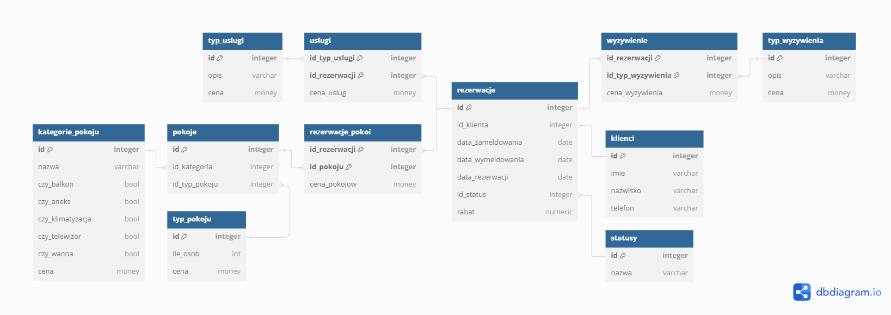
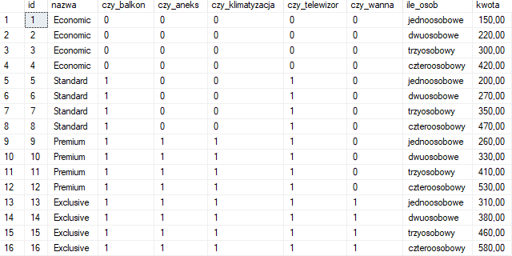
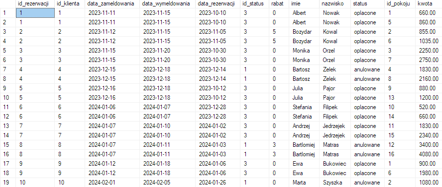
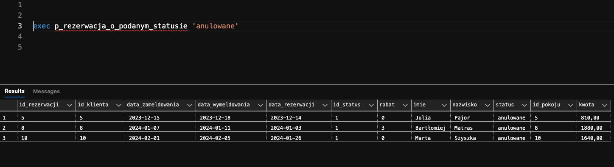
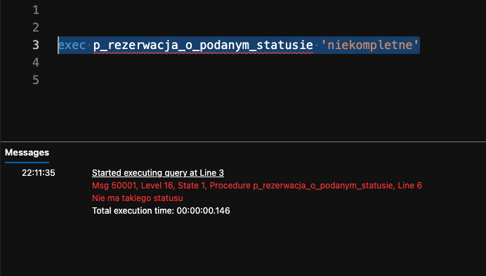
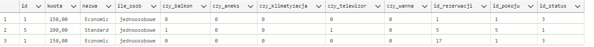

<!-- <style>
 p,li {
    font-size: 12pt;
  }
</style>  -->

<!-- <style>
 pre {
    font-size: 8pt;
  }
</style>  -->


---


**Temat:** Hotel - Rezerwacja Miejsc Noclegowych

**Autorzy:** Wojciech Kwiatkowski, Adam Orzeł, Bartosz Lasoń, Kacper Kaleta, Marcin Marszałek

--- 

# 1.  Zakres i krótki opis systemu


Celem projektu jest stworzenie systemu umożliwiającego ewidencjonowanie i zarządzanie rezerwacjami pokoi hotelowych.

Hotel oferuje pokoje na wynajem.
Pokoje są jedno, dwu, trzy-cztero osobowe.
Oferują różny stopień wyposażenia: balkon (możliwość palenia papierosów), aneks, klimatyzacja, telewizor, wanna lub prysznic.
Rezerwacja może zostać poszerzona o dodatkowe usługi: sauna i/lub wypożyczenie rowerów.
Hotel oferuje trzy standardy wyżywienia: śniadanie, obiadokolacja + śniadanie, all inclusive.

Zakres wynajmu wynosi od 1 doby do maksymalnie 2 tygodni.
Rezerwacja musi zostac dokonana minimum na 48h przed zameldowaniem, aby system mógł zatwierdzić rezerwacje klienta.
W czasie rezerwacji system będzie sprawdzał czy dany pokój jest dostępny, jeśli nie to czy jest wolny podobny pokój o szukanych wymaganiach. Jeśli klient zdecyduje się przedłużyc okres wynajmu, system sprawdza czy konkretny pokój nie został uwcześnie zarezerwowany przez innego klienta w danym terminie.

---

*Informacje dla nas na podstawie których będziemy tworzyć rezerwacje w bazie danych.*

**Cenna bazowa za rozmiar pokoju**:
- jednoosobowe 150 zł
- dwuosobowe 220 zł
- trzyosobowy 300 zł
- czteroosobowy 420 zł

**Kategorie pokojów**
- economic(bez dodatkowego wyposażenia) + 0 zł
- standard (telewizor, balkon) + 50 zł
- premium(standard + klimatyzacja, aneks) + 110 zł
- exclusive(premium + wanna) + 160 zł


**Dodatkowe usługi:**  
- możliwoś korzystania z sauny: 20zł 
- wypożyczenie roweru: 30zł

**Wyżywienie za dzień:**
- śniadanie: 15zł
- obiadokolacja + śniadanie: 40zł
- all inclusive: 80zł

---  

Na podstawie wybranych parametrów pokoju oraz oferty usług wyliczany będzie koszt całkowity za pobyt klienta/ów.
Jeśli czas pobytu będzie przekraczał tydzień zostanie doliczony rabat w wysokości 10 % od całkowitej kwoty pobytu.
Rabat za czas można łączyć z pozostałymi rabatami.  


# 2.	Wymagania i funkcje systemu


### Lista wymagań: 
- wyświetlanie specyfikacji pokoju
- wyświetlanie informacji o rezerwacji 
- wyświetlanie informacji o dostepnych pokojach w danych terminach o konkretnych parametrach
- dodawanie rezerwacji 
- modyfikacja rezerwacji
- usuwanie rezerwacji
- obliczanie całkowitego kosztu pobytu

### Przypadki użycia:
1) Klient chce zapoznać się z ofertą dostępnym pokoi w konkretnym terminie.
2) Klient chce zapoznać się z wyposażeniem wybranego pokoju.
3) Klient chce zapoznać z dodatkowymi usługami hotelu.
4) Klient chce zarezerwować pokój.
5) Klient chce przedłużyć pobyt.
6) Pracownik chce sprawdzić ilość obecnie zajętych pokoi.
7) Właściciel chce raport z danego okresu.
8) Klient chce dostać kwote wynajmu.
9) Właściciel chce wiedzieć ile klientów skorzystało z jakichkolwiek rabatów w danym okresie.
10) Pracownik chce sprawdzić kiedy pokój zostanie zwolniony


# 3.	Projekt bazy danych

## Schemat bazy danych

<!-- dodać cenne do wybranych_usług -->
<!-- cenna za konkretne usługi a sume sie wyliczy -->
<!--  -->

<!-- Wstawic nowe zdjecie -->
 


<!-- Na następne zajęcia -->

## Opis poszczególnych tabel

(Dla każdej tabeli opis w formie tabelki)


Nazwa tabeli: (nazwa tabeli)
- Opis: (opis tabeli, komentarz)

---
### Tabela rezerwacje

**Opis**: Tabela rezerwacje przechowuje informacje o rezerwacjach dokonywanych przez klientów. Każdy rekord w tej tabeli odnosi się do konkretnej rezerwacji, zawierając szczegóły takie jak dane klienta, daty zameldowania i wymeldowania, status rezerwacji oraz ewentualny rabat.

| Nazwa atrybutu | Typ  | Opis/Uwagi |
|----------------|------|------------|
| ID             | int  | Primary key, auto increment|
| id_klienta    | int     |    Foreign key        |
|data_zamelodwania|date| Data zameldowania w pokoju |
| data_wymeldowania | date | Data wymedlowania z pokoju |
| data_rezerwacji | date | Data rezerwacji pokoju |
| id_status | int | Foreign key |
| rabat | numeric | Opcjonalnie doliczany rabat przy kwocie końcowej za pobyty wyrażony w % |

---
### Tabela wyżywienie

**Opis**: Tabela łącząca tabelę rezerwacje z typ_wyzywienia. Odpowiada za zapis poszczególnych rezerwacji wyżywień (można zobaczyć starą cenę wyżywienia)

| Nazwa atrybutu | Typ  | Opis/Uwagi |
|----------------|------|------------|
| id_rezerwacji    | int | Primary Key, Klucz główny połączony z id_typ_wyzywienia, odnosi się do id rezerwacji             |
| id_typ_wyzywienia    | int      | Primary Key,  Klucz główny połączony z id_rezerwacji, odnosi się do id poszczególnego typu wyżywienia          |
| cena_wyzywienia    | money      | Zapis ceny poszczególnej rezerwacji typu wyżywienia         |

---
### Tabela typ_wyzywienia

**Opis**: Tabela opisująca typy wyżywienia w hotelu. Można dowolnie zmieniać ceny bez wpływu na zapisane rezerwacje wyżywienia.

| Nazwa atrybutu | Typ  | Opis/Uwagi |
|----------------|------|------------|
| id    | int | Primary Key, Auto Increment, identyfikator typu wyżywienia             |
| opis    | varchar      | Opis typu wyżywienia          |
| cena    | money      | Cena typu wyżywienia         |

---
### Tabela klienci

 **Opis**: Tabela zawiera podstawowe informacje o klientach id klienta , imie, nazwisko i jego numer telefonu

 | Nazwa atrybutu | Typ | Opis/Uwagi   |
|-------------------|-----|----------------| 
| id                        |int   |primary_key    |
| imie                    |var  | Imie klienta    |
| nazwisko            |var  | Nazwisko klienta |
| telefon                       | var  |  Numer telefonu klienta |

---
### Tabela statusy

**Opis**: Tabela zawiera id statusu i nazwę statusu na jakim jest rezerwacja np.”Odrzucona”

| Nazwa atrybutu | Typ | Opis/Uwagi |
 |----------------|-------|---------------|
 | id                   |int      | primary_key  | 
 | nazwa            |var     | Nazwa statustu na jakim jest rezerwacja |

---
### Tabela usługi

**Opis**: Tabela łącznikowa dla tabeli rezerwacje oraz typ_usługi. Oprócz łączenia tych tabel przez ich identyfikatory posiada także atrybut cena_usługi, która wskazuje cenę za jaką usługa została przy danej rezerwacji sprzedana.

| Nazwa atrybutu | Typ  | Opis/Uwagi |
|----------------|------|------------|
| id_typ_uslugi    |   integer   |     Primary Key razem z atrybutem id_rezerwacji, zawiera numer identyufikujący daną rezerwację       |
| id_rezerwacji    |   integer   |     Primary Key razem z atrybutem id_typ_usługi, zawiera numer identyfikujący daną usługę      |
| cena_uslugi    |   money   |      Atrybut określa cenę usługi dla danej rezerwacji      |

---
### Tabela typ_usług

**Opis**: Tabela zawiera podstawowe informacje o dostępnych usługach, takie jak ich identyfikator, nazwa danej usługi oraz jej cena dla klienta w danej chwili.

| Nazwa atrybutu | Typ  | Opis/Uwagi |
|----------------|------|------------|
| id   |   integer   |     Primary Key, autoincrement, zawiera numer identyfikujący daną usługę       |
| opis    |   varchar   |      Opisowa nazwa usługi      |
| cena    |   money   |      Atrybut określa cenę danej usługi w danym momencie      |

---
### Tabela rezerwacje_pokoi

**Opis**: Tabela rezerwacje_pokoi służy do przechowywania informacji o pokojach zarezerwowanych w ramach poszczególnych rezerwacji. Pozwala na powiązanie konkretnych pokoi z rezerwacjami oraz określenie ceny za wynajem tych pokoi.


| Nazwa atrybutu | Typ  | Opis/Uwagi |
|----------------|------|------------|
| id_rezerwacji | int | Primary key |
| id_pokoju | int | Primary key |
| cena_pokojow | money | Cena za zarezerowane pokoje |

---
### Tabela pokoje

**Opis**: Tabela pokoje przechowuje informacje o poszczególnych pokojach dostępnych w obiekcie hotelowym. Każdy pokój jest przypisany do określonej kategorii i konkretnego typu pokoju.

| Nazwa atrybutu | Typ  | Opis/Uwagi |
|----------------|------|------------|
| id | int | Primary key, Auto increment |
| id_kategoia | int | Numer kategorii pokoju |
| id_typ_pokoju | int | Numer typu pokoju |

---
### Tabela kategorie_pokoju

**Opis**: Tabela kategorie_pokoju przechowuje informacje o różnych kategoriach pokoi dostępnych w obiekcie hotelowym. Każda kategoria pokoju charakteryzuje się unikalnymi cechami, takimi jak obecność balkonu, aneksu kuchennego, klimatyzacji, czy telewizora.


| Nazwa atrybutu | Typ  | Opis/Uwagi |
|----------------|------|------------|
| id | int | Primary key, autoincrement |
| nazwa | varchar | Nazwa kategorii |
| czy_balkon | BIT | Czy pokoj w danej kategorii zawiera balkon |
| czy_aneks | BIT | Czy pokoj w danej kategorii zawiera aneks |
| czy_klimatyzacja | BIT | Czy pokoj w danej kategorii zawiera klimatyzacje |
| czy_ telewizor | BIT | Czy pokoj w danej kategorii zawiera wanne |
| cena | money | Cena danej kategorii |

---
### Tabela typ_pokoju

**Opis**: Tabela typ_pokoju przechowuje informacje o różnych typach pokoi dostępnych w hotelu. Zawiera dane dotyczące liczby osób, które mogą przebywać w pokoju, oraz ceny za poszczególny typ pokoju.


| Nazwa atrybutu | Typ  | Opis/Uwagi |
|----------------|------|------------|
| id | int | Primary key, autoincrement |
| ile_osob | nvarchar | Ilość osób |
| cena | money | Cena danego typu |

# 4.	Implementacja

## Kod poleceń DDL

(dla każdej tabeli należy wkleić kod DDL polecenia tworzącego tabelę)


#### Tabela rezerwacje
```sql
CREATE TABLE rezerwacje (
  id integer IDENTITY(1,1) PRIMARY KEY,
  id_klienta integer,
  data_zameldowania date,
  data_wymeldowania date,
  data_rezerwacji date,
  id_status integer,
  rabat numeric CHECK (rabat >= 0 AND rabat <= 100)
);

```

#### Tabela wyzywienie
```sql
CREATE TABLE wyzywienie (
  id_rezerwacji integer,
  id_typ_wyzywienia integer,
  cena_wyzywienia money CHECK (cena_wyzywienia > 0),
  PRIMARY KEY (id_rezerwacji, id_typ_wyzywienia),
);

```

#### Tabela typ_wyzywienia
```sql
CREATE TABLE typ_wyzywienia (
  id integer IDENTITY(1,1) PRIMARY KEY,
  opis nvarchar(30),
  cena money CHECK (cena > 0)
)
```

#### Tabela klienci
```sql
CREATE TABLE klienci (
  id integer IDENTITY(1,1) PRIMARY KEY,
  imie nvarchar(12),
  nazwisko nvarchar(15),
  telefon nvarchar(15)
)
```

#### Tabela statusy
```sql
CREATE TABLE statusy (
  id integer IDENTITY(1,1) PRIMARY KEY,
  nazwa nvarchar(11)
)
```

#### Tabela uslugi
```sql
CREATE TABLE uslugi (
  id_typ_uslugi integer,
  id_rezerwacji integer,
  cena_uslug money CHECK (cena_uslug > 0),
  PRIMARY KEY (id_typ_uslugi, id_rezerwacji)
)
```

#### Tabela typ_uslugi
```sql
CREATE TABLE typ_uslugi (
  id integer IDENTITY(1,1) PRIMARY KEY,
  opis nvarchar(5),
  cena money CHECK (cena > 0)
)
```

#### Tabela rezerwacje_pokoi
```sql
CREATE TABLE rezerwacje_pokoi (
  id_rezerwacji integer,
  id_pokoju integer,
  cena_pokojow money CHECK (cena_pokojow > 0),
  PRIMARY KEY (id_rezerwacji, id_pokoju)
)
```

#### Tabela pokoje
```sql
CREATE TABLE pokoje (
  id integer IDENTITY(1,1) PRIMARY KEY,
  id_kategoria integer,
  id_typ_pokoju integer
)
```

#### Tabela kategorie_pokoju
```sql
CREATE TABLE kategorie_pokoju (
  id integer IDENTITY(1,1) PRIMARY KEY,
  nazwa nvarchar(9),
  czy_balkon BIT,
  czy_aneks BIT,
  czy_klimatyzacja BIT,
  czy_telewizor BIT,
  czy_wanna BIT,
  cena money CHECK (cena >= 0)
)
```

#### Tabela typ pokoju
```sql
CREATE TABLE typ_pokoju (
  id integer IDENTITY(1,1) PRIMARY KEY,
  ile_osob nvarchar(20),
  cena money CHECK (cena > 0)
)
```

## Związki
```sql
ALTER TABLE rezerwacje ADD FOREIGN KEY (id_klienta) REFERENCES klienci (id)
```

```sql
ALTER TABLE rezerwacje_pokoi ADD FOREIGN KEY (id_rezerwacji) REFERENCES rezerwacje (id)
```

```sql
ALTER TABLE rezerwacje_pokoi ADD FOREIGN KEY (id_pokoju) REFERENCES pokoje (id)
```

```sql
ALTER TABLE pokoje ADD FOREIGN KEY (id_kategoria) REFERENCES kategorie_pokoju (id)
```

```sql
ALTER TABLE rezerwacje ADD FOREIGN KEY (id_status) REFERENCES statusy (id)
```

```sql
ALTER TABLE wyzywienie ADD FOREIGN KEY (id_rezerwacji) REFERENCES rezerwacje (id)
```

```sql
ALTER TABLE wyzywienie ADD FOREIGN KEY (id_typ_wyzywienia) REFERENCES typ_wyzywienia (id)
```

```sql
ALTER TABLE uslugi ADD FOREIGN KEY (id_typ_uslugi) REFERENCES typ_uslugi (id)
```

```sql
ALTER TABLE uslugi ADD FOREIGN KEY (id_rezerwacji) REFERENCES rezerwacje (id)
```

```sql
ALTER TABLE pokoje ADD FOREIGN KEY (id_typ_pokoju) REFERENCES typ_pokoju (id)
```

## Dane do tabel

**Tabela typ_pokoju**

```sql
INSERT INTO typ_pokoju
VALUES
('jednoosobowe', 150.0),
('dwuosobowe', 220.0),
('trzyosobowy', 300.0),
('czteroosobowy', 420.0)
```

**TABELA TYP_USLUGI**

```sql
INSERT INTO typ_uslugi
VALUES
('rower', 20.0000),
('sauna', 30.0000)
```
**TABELA USŁUGI**
```sql
INSERT INTO uslugi
VALUES
(2, 5, 30.0000),
(2, 6, 30.0000),
(1, 6, 20.0000),
(1, 7, 20.0000),
(2, 7, 30.0000),
(1, 11, 20.0000),
(2, 13, 30.0000),
(2, 14, 30.0000),
(2, 16, 30.0000),
(1, 18, 20.0000),
(2, 19, 30.0000),
(2, 20, 30.0000),
(1, 20, 20.0000);
```

**TABELA KLIENCI**
```sql
INSERT INTO klienci
VALUES
('Albert', 'Nowak', '+48 912 345 678'),
('Bożydar', 'Kowal', '+48 923 456 789'),
('Monika', 'Orzeł', '+48 934 567 890'),
('Bartosz', 'Zelek', '+48 945 678 901'),
('Julia', 'Pajor', '+48 956 789 012'),
('Stefania', 'Filipek', '+48 967 890 123'),
('Andrzej', 'Jędrzejek', '+48 978 901 234'),
('Bartłomiej', 'Matras', '+48 989 012 345'),
('Ewa', 'Bukowiec', '+48 991 123 456'),
('Marta', 'Szyszka', '+48 992 234 567'),
('Izabela', 'Pieniążek', '+48 993 345 678'),
('Karolina', 'Ząbek', '+48 994 456 789'),
('Piotr', 'Kowalik', '+48 995 567 890'),
('Jan', 'Uryga', '+48 996 678 901'),
('Adam', 'Dudek', '+48 997 789 012'),
('Kacper', 'Dutka', '+48 998 890 123'),
('Wojciech', 'Pociecha', '+48 999 901 234'),
('Marcin', 'Franczak', '+48 912 012 345'),
('Beata', 'Piegza', '+48 923 123 456'),
('Agata', 'Wojcieszak', '+48 934 234 567')
```

**tabela statusy**

```sql
INSERT INTO statusy
VALUES 
('anulowane'),
('nieopłacone'),
('opłacone')
```

**Tabela typ_wyzywienia**

```sql
INSERT INTO typ_wyzywienia
VALUES
('sniadanie', 15.00),
('obiadokolacja + sniadanie', 40.00),
('all inclusive', 80.00);
```

**Tabela wyzywienie**

```sql
INSERT INTO wyzywienie
VALUES
(1, 1, 15),
(2, 1, 15),
(3, 2, 40),
(4, 3, 80),
(5, 2, 40),
(7, 2, 40),
(9, 1, 15),
(10, 3, 80),
(11, 3, 80),
(12, 3, 80),
(13, 1, 15),
(14, 2, 40),
(17, 1, 15),
(19, 3, 80),
(20, 2, 40);
```

**Tabela kategorie_pokoju**
```sql
INSERT INTO kategorie_pokoju
VALUES 
('Economic', 0, 0, 0, 0, 0, 0),
('Standard', 1, 0, 0, 1, 0, 50),
('Premium', 1, 1, 1, 1, 0, 110),
('Exclusive', 1, 1, 1, 1, 1, 160); 
```

**Tabela pokoje**
```sql
INSERT INTO pokoje
VALUES 

(1, 1),
(1, 2),
(1, 3),
(1, 4),
(2, 1),
(2, 2),
(2, 3),
(2, 4),
(3, 1),
(3, 2),
(3, 3),
(3, 4),
(4, 1),
(4, 2),
(4, 3),
(4, 4);
```

**Tabela rezerwacje_pokoi**
```sql

INSERT INTO rezerwacje_pokoi
VALUES
(1, 1, 150),
(2, 2, 220),
(3, 3, 300),
(4, 4, 420),
(5, 5, 200),
(6, 6, 270),
(7, 7, 350),
(8, 8, 470),
(9, 9, 260),
(10, 10, 330),
(11, 11, 410),
(12, 12, 530),
(13, 13, 310),
(14, 14, 380),
(15, 15, 460),
(16, 16, 580),
(17, 1, 150),
(18, 2, 220),
(19, 3, 300),
(20, 4, 420);

```


**Tabela rezerwacje**
```sql
INSERT INTO rezerwacje
VALUES
(1, '2023-11-11', '2023-11-15', '2023-10-10', 3, 0),
(2, '2023-12-16', '2023-12-18', '2023-10-12', 3, 0),
(3, '2023-11-15', '2023-11-20', '2023-10-30', 3, 0),
(4, '2023-11-12', '2023-11-15', '2023-11-05', 3, 5),
(5, '2023-12-15', '2023-12-18', '2023-12-14', 1, 0),
(6, '2024-01-06', '2024-01-07', '2023-12-28', 3, 0),
(7, '2024-01-07', '2024-01-10', '2024-01-02', 3, 0),
(8, '2024-01-07', '2024-01-11', '2024-01-03', 1, 3),
(9, '2024-01-12', '2024-01-18', '2024-01-06', 3, 0),
(10, '2024-02-01', '2024-02-05', '2024-01-26', 1, 0),
(11, '2024-02-16', '2024-02-20', '2024-02-04', 3, 5),
(12, '2024-03-02', '2024-03-05', '2024-02-24', 3, 0),
(13, '2024-03-02', '2024-03-05', '2024-02-24', 3, 0),
(14, '2024-03-12', '2024-03-17', '2024-03-06', 3, 0),
(15, '2024-04-12', '2024-03-25', '2024-03-30', 3, 10),
(16, '2024-05-01', '2024-05-06', '2024-04-20', 3, 5),
(17, '2024-05-05', '2024-05-08', '2024-05-01', 3, 0),
(18, '2024-05-05', '2024-05-08', '2024-05-01', 3, 0),
(19, '2024-05-20', '2024-05-25', '2024-05-15', 3, 0),
(20, '2024-05-20', '2024-05-30', '2024-06-02', 2, 0);
```

## Widoki


(dla każdego widoku należy wkleić kod polecenia definiującego widok wraz z komentarzem)

1. wyświetlanie specyfikacji pokoju

```sql
CREATE VIEW vw_specyfikacja_pokoju AS
SELECT p.id, k.nazwa, k.czy_balkon, k.czy_aneks, k.czy_klimatyzacja, k.czy_telewizor, k.czy_wanna, tp.ile_osob, (tp.cena + kp.cena) AS kwota
FROM pokoje as p
INNER JOIN kategorie_pokoju as k on p.id_kategoria = k.id
INNER JOIN typ_pokoju as tp on p.id_typ_pokoju = tp.id
INNER JOIN kategorie_pokoju as kp on p.id_kategoria = kp.id
```



2. wyświetlanie informacji o rezerwacji 

```sql
CREATE VIEW vw_rezerwacja AS
SELECT r.id AS id_rezerwacji, r.id_klienta, r.data_zameldowania, r.data_wymeldowania, r.data_rezerwacji, r.id_status, r.rabat, k.imie, k.nazwisko, s.nazwa as status, rp.id_pokoju, ABS((COALESCE(SUM(u.cena_uslug), 0) + COALESCE(SUM(rp.cena_pokojow), 0) + COALESCE(SUM(w.cena_wyzywienia), 0)) * DATEDIFF(day,r.data_wymeldowania, r.data_zameldowania)) AS kwota
FROM rezerwacje AS r
LEFT JOIN uslugi AS u ON r.id = u.id_rezerwacji
LEFT JOIN rezerwacje_pokoi AS rp ON r.id = rp.id_rezerwacji
LEFT JOIN wyzywienie AS w ON r.id = w.id_rezerwacji
INNER JOIN klienci AS k ON r.id_klienta = k.id
INNER JOIN statusy AS s ON r.id_status = s.id
GROUP BY r.id, r.id_klienta, r.data_zameldowania, r.data_wymeldowania, r.data_rezerwacji, r.id_status, r.rabat, k.imie, k.nazwisko, s.nazwa, rp.id_pokoju;
```



3. Wyświetlanie informacji o dostępnych pokojach w danym momencie biorąc pod uwage 48 godzinny czas zatwierdzenia rezerwacji.

```sql
CREATE   VIEW [dbo].[vw_dostepne_pokoje] AS
SELECT p.id, (tp.cena + kp.cena) AS kwota, k.nazwa, tp.ile_osob, k.czy_balkon, k.czy_aneks, k.czy_klimatyzacja, k.czy_telewizor, k.czy_wanna, rp.id_rezerwacji, rp.id_pokoju, r.data_zameldowania, r.data_wymeldowania, r.id_status
FROM pokoje as p
INNER JOIN kategorie_pokoju as k on p.id_kategoria = k.id
INNER JOIN rezerwacje_pokoi as rp on p.id = rp.id_pokoju
INNER JOIN rezerwacje as r on rp.id_rezerwacji = r.id
INNER JOIN typ_pokoju as tp on p.id_typ_pokoju = tp.id
INNER JOIN kategorie_pokoju as kp on p.id_kategoria = kp.id
WHERE DATEADD(DAY, 2, GETDATE()) NOT BETWEEN r.data_zameldowania AND r.data_wymeldowania
```


## Procedury/funkcje

(dla każdej procedury/funkcji należy wkleić kod polecenia definiującego procedurę wraz z komentarzem)

### Procedury

---
**Dodawanie rezerwacji** - do poprawienia
```sql
CREATE PROCEDURE p_dodanie_rezerwacji
@imie nvarchar(12), @nazwisko nvarchar(15), @telefon nvarchar(15), @data_zameldowania date, @data_wymeldowania date, @id_status int, @rabat int
as
begin
	if @data_zameldowania >= @data_wymeldowania
	throw 50001, 'Data zameldowania musi być wcześniejsza niż wymeldowania', 1;
	if ABS(DATEDIFF(day,GETDATE(),@data_zameldowania))<2
	throw 50001, 'Rezerwacja musi zostac dokonana minimum na 48h przed zameldowaniem', 1;
	if ABS(DATEDIFF(day, @data_zameldowania, @data_wymeldowania))>14
	throw 50001, 'Okres rezerwacji nie może być dłuższy niż 14 dni', 1;
	if(ABS(DATEDIFF(day, @data_zameldowania, @data_wymeldowania))>7
	@rabat = @rabat + 10;

	INSERT INTO klienci
	VALUES(@imie, @nazwisko, @telefon);

	SET @id_klienta = SCOPE_IDENTITY();

	INSERT INTO rezerwacje
	VALUES(@id_klienta, @data_zameldowania, data_zameldowania, GETDATE(), @id_status, @rabat);
end;
```sql

---
**Rezerwacja o podanym statusie**
```sql
create or alter procedure p_rezerwacja_o_podanym_statusie 
@status_rezerwacji char(11)
as
begin
    if not exists (select * from statusy where nazwa = @status_rezerwacji)
        throw 50001, 'Nie ma takiego statusu', 1;
	
    select *
	from vw_rezerwacja
	where status = @status_rezerwacji
end;
```

**Opis:** *Procedura ta przy wykorzystaniu widoku vw_rezerwacja wyswietla informacje o rezerwacjach posiadajacych wybrany status.*





---

**Dostępne pokoje o podanej ilości osób w danym zakresie cenowym**

```sql
create procedure p_dostepne_pokoje_o_podanej_ilosci_w_danym_zakresie_cenowym 
@ilosc_osob char(20), @min_kwota money, @max_kwota money
as
begin
    if @min_kwota > @max_kwota
        throw 50001, 'Błędny przedział', 1;
    if not exists (select * from typ_pokoju where ile_osob = @ilosc_osob)
        throw 50001, 'Nie ma pokoju o takiej ilości miejsc', 1;
	
    select *
	from vw_dostepne_pokoje
	where ile_osob = @ilosc_osob
        and kwota between @min_kwota and @max_kwota
end;
```

**Opis:** *Procedura ta na podstawie widoku vw_dostepne_pokoje wyswietla dostepne pokoje o podanej ilosci osob w danym zakresie cenowym. Uwaga: Rozwiązać problem duplikujących się pokoi.*

exec p_dostepne_pokoje_o_podanej_ilosci_w_danym_zakresie_cenowym 'jednoosobowe', 150, 200



### Funkcje

**Obliczanie całkowitego kosztu rezerwacji**

```sql
CREATE FUNCTION [dbo].[calkowity_koszt] (@id_rezerwacji INT)
RETURNS MONEY 
AS BEGIN   
DECLARE @ckoszt MONEY;
DECLARE @rabat DECIMAL;

----------------------------------------------------------------------------------
DECLARE @liczba_dni INT;
 SELECT @liczba_dni = DATEDIFF(DAY, r.data_zameldowania, r.data_wymeldowania),@rabat = r.rabat
    FROM rezerwacje r
    WHERE r.id = @id_rezerwacji;
----------------------------------------------------------------------------------

 SELECT @ckoszt = ISNULL(SUM(u.cena_uslug), 0) + ISNULL(SUM(rp.cena_pokojow*@liczba_dni), 0) + ISNULL(SUM(w.cena_wyzywienia*@liczba_dni), 0) 
    FROM rezerwacje r
    LEFT JOIN uslugi u ON r.id = u.id_rezerwacji
    LEFT JOIN rezerwacje_pokoi rp ON r.id = rp.id_rezerwacji
    LEFT JOIN wyzywienie w ON r.id = w.id_rezerwacji
    WHERE r.id = @id_rezerwacji;

	    SET @ckoszt = @ckoszt * (1 - @rabat / 100.0);

    RETURN @ckoszt;   
	END; 
-----------------/*Wyświetlenie*/-----------------
GO 
select dbo.calkowity_koszt(20) as calkowity_koszt /*( ) - id_rezerwacji*/
GO
```

**Opis:** *Funkcja sumuje koszty usług, pokoi oraz wyżywienia z rezerwacji, używa do tego JOIN aby połączyć tabele rezerwacji, usługi, rezerwacje_pokoi i wyżywienia. Sumuje koluny z kosztami, jeżeli któraś z kolumn nie zawiera danych wstawia 0.*


## Triggery

(dla każdego triggera należy wkleić kod polecenia definiującego trigger wraz z komentarzem)

### trg_zapobiegaj_duplikacji_klientow

```sql

CREATE TRIGGER trg_zapobiegaj_duplikacji_klientow
ON klienci
INSTEAD OF INSERT
AS
BEGIN
    DECLARE @noweImie NVARCHAR(12), @noweNazwisko NVARCHAR(15), @nowyTelefon NVARCHAR(15)
    SELECT @noweImie = i.imie, @noweNazwisko = i.nazwisko, @nowyTelefon = i.telefon
    FROM inserted i

    IF EXISTS (SELECT 1 FROM klienci 
               WHERE imie = @noweImie AND nazwisko = @noweNazwisko AND telefon = @nowyTelefon)
    BEGIN
        RAISERROR ('Klient jest juz w bazie.', 16, 1)
        ROLLBACK TRANSACTION
    END
    ELSE
    BEGIN
        INSERT INTO klienci (imie, nazwisko, telefon)
        SELECT imie, nazwisko, telefon
        FROM inserted
    END
END
GO

```

**Opis:** Trigger ten zapewnia integralność danych w tabeli klienci, eliminując możliwość występowania zduplikowanych rekordów klientów.


---

