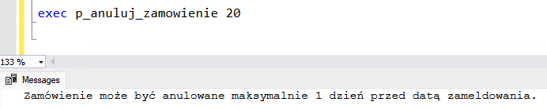

<!-- <style>
 p,li {
    font-size: 12pt;
  }
</style>  -->

<!-- <style>
 pre {
    font-size: 8pt;
  }
</style>  -->


---


**Temat:** Hotel - Rezerwacja Miejsc Noclegowych

**Autorzy:** Wojciech Kwiatkowski, Adam Orzeł, Bartosz Lasoń, Kacper Kaleta, Marcin Marszałek

--- 

# 1.  Zakres i krótki opis systemu


Celem projektu jest stworzenie systemu umożliwiającego ewidencjonowanie i zarządzanie rezerwacjami pokoi hotelowych.

Hotel oferuje pokoje na wynajem.
Pokoje są jedno, dwu, trzy-cztero osobowe.
Oferują różny stopień wyposażenia: balkon (możliwość palenia papierosów), aneks, klimatyzacja, telewizor, wanna lub prysznic.
Rezerwacja może zostać poszerzona o dodatkowe usługi: sauna i/lub wypożyczenie rowerów.
Hotel oferuje trzy standardy wyżywienia: śniadanie, obiadokolacja + śniadanie, all inclusive.

Zakres wynajmu wynosi od 1 doby do maksymalnie 2 tygodni.
Rezerwacja musi zostac dokonana minimum na 48h przed zameldowaniem, aby system mógł zatwierdzić rezerwacje klienta.
W czasie rezerwacji system będzie sprawdzał czy dany pokój jest dostępny, jeśli nie to czy jest wolny podobny pokój o szukanych wymaganiach. Jeśli klient zdecyduje się przedłużyc okres wynajmu, system sprawdza czy konkretny pokój nie został uwcześnie zarezerwowany przez innego klienta w danym terminie.

---

*Informacje dla nas na podstawie których będziemy tworzyć rezerwacje w bazie danych.*

**Cenna bazowa za rozmiar pokoju**:
- jednoosobowe 150 zł
- dwuosobowe 220 zł
- trzyosobowy 300 zł
- czteroosobowy 420 zł

**Kategorie pokojów**
- economic(bez dodatkowego wyposażenia) + 0 zł
- standard (telewizor, balkon) + 50 zł
- premium(standard + klimatyzacja, aneks) + 110 zł
- exclusive(premium + wanna) + 160 zł


**Dodatkowe usługi:**  
- możliwoś korzystania z sauny: 20zł 
- wypożyczenie roweru: 30zł

**Wyżywienie za dzień:**
- śniadanie: 15zł
- obiadokolacja + śniadanie: 40zł
- all inclusive: 80zł

---  

Na podstawie wybranych parametrów pokoju oraz oferty usług wyliczany będzie koszt całkowity za pobyt klienta/ów.
Jeśli czas pobytu będzie przekraczał tydzień zostanie doliczony rabat w wysokości 10 % od całkowitej kwoty pobytu.
Rabat za czas można łączyć z pozostałymi rabatami.  


# 2.	Wymagania i funkcje systemu


### Lista wymagań: 
- wyświetlanie specyfikacji pokoju
- wyświetlanie informacji o rezerwacji 
- wyświetlanie informacji o dostepnych pokojach w danych terminach
- dodawanie rezerwacji 
- modyfikacja rezerwacji
- anulowanie rezerwacji
- obliczanie całkowitego kosztu pobytu

### Przypadki użycia:
1) Klient chce zapoznać się z ofertą dostępnym pokoi w konkretnym terminie.
2) Klient chce zapoznać się z wyposażeniem wybranego pokoju.
3) Klient chce zapoznać z dodatkowymi usługami hotelu.
4) Klient chce zarezerwować pokój.
5) Klient chce przedłużyć pobyt.
6) Klient chce dostać kwote wynajmu.
7) Pracownik chce sprawdzić kiedy pokój zostanie zwolniony


# 3.	Projekt bazy danych

## Schemat bazy danych

<!-- dodać cenne do wybranych_usług -->
<!-- cenna za konkretne usługi a sume sie wyliczy -->
<!--  -->

<!-- Wstawic nowe zdjecie -->
 


<!-- Na następne zajęcia -->

## Opis poszczególnych tabel

(Dla każdej tabeli opis w formie tabelki)


Nazwa tabeli: (nazwa tabeli)
- Opis: (opis tabeli, komentarz)

---
### Tabela rezerwacje

**Opis**: Tabela rezerwacje przechowuje informacje o rezerwacjach dokonywanych przez klientów. Każdy rekord w tej tabeli odnosi się do konkretnej rezerwacji, zawierając szczegóły takie jak dane klienta, daty zameldowania i wymeldowania, status rezerwacji oraz ewentualny rabat.

| Nazwa atrybutu | Typ  | Opis/Uwagi |
|----------------|------|------------|
| ID             | int  | Primary key, auto increment|
| id_klienta    | int     |    Foreign key        |
|data_zamelodwania|date| Data zameldowania w pokoju |
| data_wymeldowania | date | Data wymedlowania z pokoju |
| data_rezerwacji | date | Data rezerwacji pokoju |
| id_status | int | Foreign key |
| rabat | numeric | Opcjonalnie doliczany rabat przy kwocie końcowej za pobyty wyrażony w % |

---
### Tabela wyżywienie

**Opis**: Tabela łącząca tabelę rezerwacje z typ_wyzywienia. Odpowiada za zapis poszczególnych rezerwacji wyżywień (można zobaczyć starą cenę wyżywienia)

| Nazwa atrybutu | Typ  | Opis/Uwagi |
|----------------|------|------------|
| id_rezerwacji    | int | Primary Key, Klucz główny połączony z id_typ_wyzywienia, odnosi się do id rezerwacji             |
| id_typ_wyzywienia    | int      | Primary Key,  Klucz główny połączony z id_rezerwacji, odnosi się do id poszczególnego typu wyżywienia          |
| cena_wyzywienia    | money      | Zapis ceny poszczególnej rezerwacji typu wyżywienia         |

---
### Tabela typ_wyzywienia

**Opis**: Tabela opisująca typy wyżywienia w hotelu. Można dowolnie zmieniać ceny bez wpływu na zapisane rezerwacje wyżywienia.

| Nazwa atrybutu | Typ  | Opis/Uwagi |
|----------------|------|------------|
| id    | int | Primary Key, Auto Increment, identyfikator typu wyżywienia             |
| opis    | varchar      | Opis typu wyżywienia          |
| cena    | money      | Cena typu wyżywienia         |

---
### Tabela klienci

 **Opis**: Tabela zawiera podstawowe informacje o klientach id klienta , imie, nazwisko i jego numer telefonu

 | Nazwa atrybutu | Typ | Opis/Uwagi   |
|-------------------|-----|----------------| 
| id                        |int   |primary_key    |
| imie                    |var  | Imie klienta    |
| nazwisko            |var  | Nazwisko klienta |
| telefon                       | var  |  Numer telefonu klienta |

---
### Tabela statusy

**Opis**: Tabela zawiera id statusu i nazwę statusu na jakim jest rezerwacja np.”Odrzucona”

| Nazwa atrybutu | Typ | Opis/Uwagi |
 |----------------|-------|---------------|
 | id                   |int      | primary_key  | 
 | nazwa            |var     | Nazwa statustu na jakim jest rezerwacja |

---
### Tabela usługi

**Opis**: Tabela łącznikowa dla tabeli rezerwacje oraz typ_usługi. Oprócz łączenia tych tabel przez ich identyfikatory posiada także atrybut cena_usługi, która wskazuje cenę za jaką usługa została przy danej rezerwacji sprzedana.

| Nazwa atrybutu | Typ  | Opis/Uwagi |
|----------------|------|------------|
| id_typ_uslugi    |   integer   |     Primary Key razem z atrybutem id_rezerwacji, zawiera numer identyufikujący daną rezerwację       |
| id_rezerwacji    |   integer   |     Primary Key razem z atrybutem id_typ_usługi, zawiera numer identyfikujący daną usługę      |
| cena_uslugi    |   money   |      Atrybut określa cenę usługi dla danej rezerwacji      |

---
### Tabela typ_usług

**Opis**: Tabela zawiera podstawowe informacje o dostępnych usługach, takie jak ich identyfikator, nazwa danej usługi oraz jej cena dla klienta w danej chwili.

| Nazwa atrybutu | Typ  | Opis/Uwagi |
|----------------|------|------------|
| id   |   integer   |     Primary Key, autoincrement, zawiera numer identyfikujący daną usługę       |
| opis    |   varchar   |      Opisowa nazwa usługi      |
| cena    |   money   |      Atrybut określa cenę danej usługi w danym momencie      |

---
### Tabela rezerwacje_pokoi

**Opis**: Tabela rezerwacje_pokoi służy do przechowywania informacji o pokojach zarezerwowanych w ramach poszczególnych rezerwacji. Pozwala na powiązanie konkretnych pokoi z rezerwacjami oraz określenie ceny za wynajem tych pokoi.


| Nazwa atrybutu | Typ  | Opis/Uwagi |
|----------------|------|------------|
| id_rezerwacji | int | Primary key |
| id_pokoju | int | Primary key |
| cena_pokojow | money | Cena za zarezerowane pokoje |

---
### Tabela pokoje

**Opis**: Tabela pokoje przechowuje informacje o poszczególnych pokojach dostępnych w obiekcie hotelowym. Każdy pokój jest przypisany do określonej kategorii i konkretnego typu pokoju.

| Nazwa atrybutu | Typ  | Opis/Uwagi |
|----------------|------|------------|
| id | int | Primary key, Auto increment |
| id_kategoia | int | Numer kategorii pokoju |
| id_typ_pokoju | int | Numer typu pokoju |

---
### Tabela kategorie_pokoju

**Opis**: Tabela kategorie_pokoju przechowuje informacje o różnych kategoriach pokoi dostępnych w obiekcie hotelowym. Każda kategoria pokoju charakteryzuje się unikalnymi cechami, takimi jak obecność balkonu, aneksu kuchennego, klimatyzacji, czy telewizora.


| Nazwa atrybutu | Typ  | Opis/Uwagi |
|----------------|------|------------|
| id | int | Primary key, autoincrement |
| nazwa | varchar | Nazwa kategorii |
| czy_balkon | BIT | Czy pokoj w danej kategorii zawiera balkon |
| czy_aneks | BIT | Czy pokoj w danej kategorii zawiera aneks |
| czy_klimatyzacja | BIT | Czy pokoj w danej kategorii zawiera klimatyzacje |
| czy_ telewizor | BIT | Czy pokoj w danej kategorii zawiera wanne |
| cena | money | Cena danej kategorii |

---
### Tabela typ_pokoju

**Opis**: Tabela typ_pokoju przechowuje informacje o różnych typach pokoi dostępnych w hotelu. Zawiera dane dotyczące liczby osób, które mogą przebywać w pokoju, oraz ceny za poszczególny typ pokoju.


| Nazwa atrybutu | Typ  | Opis/Uwagi |
|----------------|------|------------|
| id | int | Primary key, autoincrement |
| ile_osob | nvarchar | Ilość osób |
| cena | money | Cena danego typu |

# 4.	Implementacja

## Kod poleceń DDL

(dla każdej tabeli należy wkleić kod DDL polecenia tworzącego tabelę)


#### Tabela rezerwacje
```sql
CREATE TABLE rezerwacje (
  id integer IDENTITY(1,1) PRIMARY KEY,
  id_klienta integer,
  data_zameldowania date,
  data_wymeldowania date,
  data_rezerwacji date,
  id_status integer,
  rabat numeric CHECK (rabat >= 0 AND rabat <= 100)
);

```

#### Tabela wyzywienie
```sql
CREATE TABLE wyzywienie (
  id_rezerwacji integer,
  id_typ_wyzywienia integer,
  cena_wyzywienia money CHECK (cena_wyzywienia > 0),
  PRIMARY KEY (id_rezerwacji, id_typ_wyzywienia),
);

```

#### Tabela typ_wyzywienia
```sql
CREATE TABLE typ_wyzywienia (
  id integer IDENTITY(1,1) PRIMARY KEY,
  opis nvarchar(30),
  cena money CHECK (cena > 0)
)
```

#### Tabela klienci
```sql
CREATE TABLE klienci (
  id integer IDENTITY(1,1) PRIMARY KEY,
  imie nvarchar(12),
  nazwisko nvarchar(15),
  telefon nvarchar(15)
)
```

#### Tabela statusy
```sql
CREATE TABLE statusy (
  id integer IDENTITY(1,1) PRIMARY KEY,
  nazwa nvarchar(11)
)
```

#### Tabela uslugi
```sql
CREATE TABLE uslugi (
  id_typ_uslugi integer,
  id_rezerwacji integer,
  cena_uslug money CHECK (cena_uslug > 0),
  PRIMARY KEY (id_typ_uslugi, id_rezerwacji)
)
```

#### Tabela typ_uslugi
```sql
CREATE TABLE typ_uslugi (
  id integer IDENTITY(1,1) PRIMARY KEY,
  opis nvarchar(5),
  cena money CHECK (cena > 0)
)
```

#### Tabela rezerwacje_pokoi
```sql
CREATE TABLE rezerwacje_pokoi (
  id_rezerwacji integer,
  id_pokoju integer,
  cena_pokojow money CHECK (cena_pokojow > 0),
  PRIMARY KEY (id_rezerwacji, id_pokoju)
)
```

#### Tabela pokoje
```sql
CREATE TABLE pokoje (
  id integer IDENTITY(1,1) PRIMARY KEY,
  id_kategoria integer,
  id_typ_pokoju integer
)
```

#### Tabela kategorie_pokoju
```sql
CREATE TABLE kategorie_pokoju (
  id integer IDENTITY(1,1) PRIMARY KEY,
  nazwa nvarchar(9),
  czy_balkon BIT,
  czy_aneks BIT,
  czy_klimatyzacja BIT,
  czy_telewizor BIT,
  czy_wanna BIT,
  cena money CHECK (cena >= 0)
)
```

#### Tabela typ pokoju
```sql
CREATE TABLE typ_pokoju (
  id integer IDENTITY(1,1) PRIMARY KEY,
  ile_osob nvarchar(20),
  cena money CHECK (cena > 0)
)
```

## Związki
```sql
ALTER TABLE rezerwacje ADD FOREIGN KEY (id_klienta) REFERENCES klienci (id)
```

```sql
ALTER TABLE rezerwacje_pokoi ADD FOREIGN KEY (id_rezerwacji) REFERENCES rezerwacje (id)
```

```sql
ALTER TABLE rezerwacje_pokoi ADD FOREIGN KEY (id_pokoju) REFERENCES pokoje (id)
```

```sql
ALTER TABLE pokoje ADD FOREIGN KEY (id_kategoria) REFERENCES kategorie_pokoju (id)
```

```sql
ALTER TABLE rezerwacje ADD FOREIGN KEY (id_status) REFERENCES statusy (id)
```

```sql
ALTER TABLE wyzywienie ADD FOREIGN KEY (id_rezerwacji) REFERENCES rezerwacje (id)
```

```sql
ALTER TABLE wyzywienie ADD FOREIGN KEY (id_typ_wyzywienia) REFERENCES typ_wyzywienia (id)
```

```sql
ALTER TABLE uslugi ADD FOREIGN KEY (id_typ_uslugi) REFERENCES typ_uslugi (id)
```

```sql
ALTER TABLE uslugi ADD FOREIGN KEY (id_rezerwacji) REFERENCES rezerwacje (id)
```

```sql
ALTER TABLE pokoje ADD FOREIGN KEY (id_typ_pokoju) REFERENCES typ_pokoju (id)
```

## Widoki


(dla każdego widoku należy wkleić kod polecenia definiującego widok wraz z komentarzem)

1. wyświetlanie specyfikacji pokoju

```sql
CREATE VIEW vw_specyfikacja_pokoju AS
SELECT p.id, k.nazwa, k.czy_balkon, k.czy_aneks, k.czy_klimatyzacja, k.czy_telewizor, k.czy_wanna, tp.ile_osob, (tp.cena + kp.cena) AS kwota
FROM pokoje as p
INNER JOIN kategorie_pokoju as k on p.id_kategoria = k.id
INNER JOIN typ_pokoju as tp on p.id_typ_pokoju = tp.id
INNER JOIN kategorie_pokoju as kp on p.id_kategoria = kp.id
```


2. wyświetlanie informacji o rezerwacji 

```sql
CREATE VIEW vw_rezerwacja AS
SELECT r.id AS id_rezerwacji, r.id_klienta, r.data_zameldowania, r.data_wymeldowania, r.data_rezerwacji, r.id_status, r.rabat, k.imie, k.nazwisko, s.nazwa as status, rp.id_pokoju, ABS((COALESCE(SUM(u.cena_uslug), 0) + COALESCE(SUM(rp.cena_pokojow), 0) + COALESCE(SUM(w.cena_wyzywienia), 0)) * DATEDIFF(day,r.data_wymeldowania, r.data_zameldowania)) AS kwota
FROM rezerwacje AS r
LEFT JOIN uslugi AS u ON r.id = u.id_rezerwacji
LEFT JOIN rezerwacje_pokoi AS rp ON r.id = rp.id_rezerwacji
LEFT JOIN wyzywienie AS w ON r.id = w.id_rezerwacji
INNER JOIN klienci AS k ON r.id_klienta = k.id
INNER JOIN statusy AS s ON r.id_status = s.id
GROUP BY r.id, r.id_klienta, r.data_zameldowania, r.data_wymeldowania, r.data_rezerwacji, r.id_status, r.rabat, k.imie, k.nazwisko, s.nazwa, rp.id_pokoju;
```


---

3. Zestawienie wybranych opcji dodatkowych

```sql

create view [dbo].[vw_zestawienie_dodatkowych_opcji] as
select u.opis as 'dodatkowe opcje', u.cena 
from typ_uslugi u 
union 
    select 'wyzywienie: ' + w.opis, w.cena 
    from typ_wyzywienia w
GO

```


## Procedury/funkcje

(dla każdej procedury/funkcji należy wkleić kod polecenia definiującego procedurę wraz z komentarzem)

## Procedury

### Wyświetlanie dostępnych pokoi w kokretnym terminie

```sql

CREATE PROCEDURE p_dostępne_pokoje
@data_poczatkowa date, @data_koncowa date
AS
BEGIN

	if @data_poczatkowa < dateadd(day, 2, getdate())
		throw 50001, 'Rezerwacja musi byc wykonana conajmniej 48h przez zameldowaniem', 1;
    if @data_koncowa < @data_poczatkowa
        throw 50001, 'Błędny przedział', 1;

    SELECT id as numer_pokoju, nazwa, czy_balkon, czy_aneks, czy_klimatyzacja, czy_telewizor, czy_wanna, ile_osob, kwota
    FROM vw_specyfikacja_pokoju
    WHERE id IN (
        SELECT DISTINCT id_pokoju
        FROM vw_rezerwacja
        WHERE id_pokoju NOT IN (
            SELECT id_pokoju
            FROM vw_rezerwacja
            WHERE ((data_zameldowania < @data_koncowa AND data_wymeldowania > @data_poczatkowa)
            OR (data_zameldowania >= @data_poczatkowa AND data_zameldowania < @data_koncowa)
            OR (data_wymeldowania > @data_poczatkowa AND data_wymeldowania <= @data_koncowa)
            OR (data_zameldowania <= @data_poczatkowa AND data_wymeldowania >= @data_koncowa))
            AND status != 'anulowane'
        )
    );
END;

```

**Opis:** Procedura p_dostępne_pokoje służy do wyszukiwania dostępnych pokoi w określonym przedziale czasowym, sprawdzając przy tym czy podana data początkowa jest większa o 2 dni od aktualnej daty ponieważ datę rezerwacji i datę zameldowania musi dzielić 48 godzin.

**Przykład 1**  

  

**Przykład 2**  

  

**Przykład 3**  


---

### Dodawanie rezerwacji - do poprawienia

```sql

CREATE PROCEDURE p_dodanie_rezerwacji
@imie nvarchar(12), @nazwisko nvarchar(15), @telefon nvarchar(15), @data_zameldowania date, @data_wymeldowania date, @id_status int, @rabat int
as
begin
	if @data_zameldowania >= @data_wymeldowania
	throw 50001, 'Data zameldowania musi być wcześniejsza niż wymeldowania', 1;
	if ABS(DATEDIFF(day,GETDATE(),@data_zameldowania))<2
	throw 50001, 'Rezerwacja musi zostac dokonana minimum na 48h przed zameldowaniem', 1;
	if ABS(DATEDIFF(day, @data_zameldowania, @data_wymeldowania))>14
	throw 50001, 'Okres rezerwacji nie może być dłuższy niż 14 dni', 1;
	if(ABS(DATEDIFF(day, @data_zameldowania, @data_wymeldowania))>7
	@rabat = @rabat + 10;

	INSERT INTO klienci
	VALUES(@imie, @nazwisko, @telefon);

	SET @id_klienta = SCOPE_IDENTITY();

	INSERT INTO rezerwacje
	VALUES(@id_klienta, @data_zameldowania, data_zameldowania, GETDATE(), @id_status, @rabat);
end;

```

**Opis:** TODO: Dodanie opisu - Kacper

TODO: Dodanie screena

---

### Rezerwacja o podanym statusie

```sql

create or alter procedure p_rezerwacja_o_podanym_statusie 
@status_rezerwacji char(11)
as
begin
    if not exists (select * from statusy where nazwa = @status_rezerwacji)
        throw 50001, 'Nie ma takiego statusu', 1;
	
    select *
	from vw_rezerwacja
	where status = @status_rezerwacji
end;

```

**Opis:** Procedura ta przy wykorzystaniu widoku vw_rezerwacja wyswietla informacje o rezerwacjach posiadajacych wybrany status.


---

### Dodawanie usługi

```sql

create or alter procedure [dbo].[p_dodaj_usluge]
@opis nvarchar(5),
@cena money
as
begin
insert into typ_uslugi (opis, cena)
values (@opis, @cena);
end

```

**Opis:** Procedura p_dodaj_usluge służy do dodawania nowej usługi do tabeli typ_uslugi. Przyjmuje dwa parametry: opis usługi oraz jej cenę.


---

### Anulowanie zamówienia

```sql

CREATE PROCEDURE [dbo].[p_anuluj_zamowienie] @id_zamowienia INT
AS
BEGIN
  DECLARE @status_anulowane INT;
  DECLARE @data_zameldowania DATE;
  
  SELECT @status_anulowane = id
  FROM statusy
  WHERE nazwa = 'anulowane';
  
  IF EXISTS (SELECT * FROM rezerwacje WHERE id = @id_zamowienia)
  BEGIN
    SELECT @data_zameldowania = data_zameldowania
    FROM rezerwacje
    WHERE id = @id_zamowienia;
    
    IF DATEDIFF(DAY, GETDATE(), @data_zameldowania) >= 1
    BEGIN
      UPDATE rezerwacje
      SET id_status = @status_anulowane
      WHERE id = @id_zamowienia;
      PRINT 'Status zamówienia został zmieniony na anulowane.';
    END
    ELSE
    BEGIN
      PRINT 'Zamówienie może być anulowane maksymalnie 1 dzień przed datą zameldowania.';
    END
  END
  ELSE
  BEGIN
    PRINT 'Zamówienie z podanym id nie istnieje.';
  END
END;

```

**Opis:** Procedura p_anuluj_zamowienie jest przeznaczona do anulowania zamówienia w systemie. Jeśli zamówienie o podanym id nie istnieje zwracana jest informacja o jego braku. W przypadku gdy próba anulowania rezerwacji jest na jeden dzień przed datą zameldowania, próba zostanie odrzucona.

*Anulowanie zamówienia*  

  

*Próba anulowania zamówienia o błędnym id*  


*Próba anulowania zamówienia z zbyt bliską datą zamelodania*  

  




## Funkcje

### Obliczanie całkowitego kosztu rezerwacji

```sql

CREATE FUNCTION [dbo].[f_calkowity_koszt] (@id_rezerwacji INT)
RETURNS MONEY 
AS BEGIN   
DECLARE @ckoszt MONEY;
DECLARE @rabat DECIMAL;

----------------------------------------------------------------------------------
DECLARE @liczba_dni INT;
 SELECT @liczba_dni = DATEDIFF(DAY, r.data_zameldowania, r.data_wymeldowania),@rabat = r.rabat
    FROM rezerwacje r
    WHERE r.id = @id_rezerwacji;
----------------------------------------------------------------------------------

 SELECT @ckoszt = ISNULL(SUM(u.cena_uslug), 0) + ISNULL(SUM(rp.cena_pokojow*@liczba_dni), 0) + ISNULL(SUM(w.cena_wyzywienia*@liczba_dni), 0) 
    FROM rezerwacje r
    LEFT JOIN uslugi u ON r.id = u.id_rezerwacji
    LEFT JOIN rezerwacje_pokoi rp ON r.id = rp.id_rezerwacji
    LEFT JOIN wyzywienie w ON r.id = w.id_rezerwacji
    WHERE r.id = @id_rezerwacji;

	    SET @ckoszt = @ckoszt * (1 - @rabat / 100.0);

    RETURN @ckoszt;   
	END; 
-----------------/*Wyświetlenie*/-----------------
GO 
select dbo.calkowity_koszt(20) as calkowity_koszt /*( ) - id_rezerwacji*/
GO

```

**Opis:** Funkcja sumuje koszty usług, pokoi oraz wyżywienia z rezerwacji, używa do tego JOIN aby połączyć tabele rezerwacji, usługi, rezerwacje_pokoi i wyżywienia. Sumuje koluny z kosztami, jeżeli któraś z kolumn nie zawiera danych wstawia 0.

*Przykład 1*


*Przykład 2*


## Triggery

(dla każdego triggera należy wkleić kod polecenia definiującego trigger wraz z komentarzem)

### trg_zapobiegaj_duplikacji_klientow

```sql

CREATE TRIGGER trg_zapobiegaj_duplikacji_klientow
ON klienci
INSTEAD OF INSERT
AS
BEGIN
    DECLARE @noweImie NVARCHAR(12), @noweNazwisko NVARCHAR(15), @nowyTelefon NVARCHAR(15)
    SELECT @noweImie = i.imie, @noweNazwisko = i.nazwisko, @nowyTelefon = i.telefon
    FROM inserted i

    IF EXISTS (SELECT 1 FROM klienci 
               WHERE imie = @noweImie AND nazwisko = @noweNazwisko AND telefon = @nowyTelefon)
    BEGIN
        RAISERROR ('Klient jest juz w bazie.', 16, 1)
        ROLLBACK TRANSACTION
    END
    ELSE
    BEGIN
        INSERT INTO klienci (imie, nazwisko, telefon)
        SELECT imie, nazwisko, telefon
        FROM inserted
    END
END
GO

```

**Opis:** Trigger ten zapewnia integralność danych w tabeli klienci, eliminując możliwość występowania zduplikowanych rekordów klientów.


---

### trg_zapobiegaj_duplikacji_rezerwacje

```sql

CREATE   TRIGGER [dbo].[trg_zapobiegaj_duplikacji_rezerwacje]
ON [dbo].[rezerwacje]
INSTEAD OF INSERT
AS
BEGIN
    DECLARE @nowy_id_klienta INT, 
            @nowa_data_zameldowania DATE, 
            @nowa_data_wymeldowania DATE, 
            @nowa_data_rezerwacji DATE, 
            @nowy_id_status INT, 
            @nowy_rabat NUMERIC(18, 0);

    SELECT @nowy_id_klienta = i.id_klienta, 
           @nowa_data_zameldowania = i.data_zameldowania, 
           @nowa_data_wymeldowania = i.data_wymeldowania, 
           @nowa_data_rezerwacji = i.data_rezerwacji, 
           @nowy_id_status = i.id_status, 
           @nowy_rabat = i.rabat
    FROM inserted i;

    IF EXISTS (SELECT 1 
               FROM rezerwacje
               WHERE id_klienta = @nowy_id_klienta 
                 AND data_zameldowania = @nowa_data_zameldowania 
                 AND data_wymeldowania = @nowa_data_wymeldowania 
                 AND data_rezerwacji = @nowa_data_rezerwacji 
                 AND id_status = @nowy_id_status 
                 AND rabat = @nowy_rabat)
    BEGIN
        RAISERROR('Rezerwacja już jest w bazie', 16, 1);
        ROLLBACK TRANSACTION;
    END
    ELSE
    BEGIN
        INSERT INTO rezerwacje (id_klienta, data_zameldowania, data_wymeldowania, data_rezerwacji, id_status, rabat)
        SELECT id_klienta, data_zameldowania, data_wymeldowania, data_rezerwacji, id_status, rabat
        FROM inserted;
    END
END;

```

**Opis:** Trigger zapobiega wstawianiu zduplikowanych rekordów do tabeli rezerwacje. W momencie próby dodania nowej rezerwacji, trigger ten sprawdza, czy rezerwacja o tych samych danych już istnieje w bazie danych. Jeśli taka rezerwacja już istnieje, operacja jest przerywana, a użytkownik otrzymuje komunikat o błędzie.


---

### trg_zapobiegaj_duplikacji_typ_uslugi

```sql

CREATE   TRIGGER [dbo].[trg_zapobiegaj_duplikacji_typ_uslugi]
ON [dbo].[typ_uslugi]
INSTEAD OF INSERT
AS
BEGIN
    DECLARE @nowy_opis NVARCHAR(5),
            @nowa_cena MONEY;
    SELECT @nowy_opis = i.opis,
           @nowa_cena = i.cena
    FROM inserted i;
    IF EXISTS (SELECT 1 
               FROM typ_uslugi
               WHERE opis = @nowy_opis 
                 AND cena = @nowa_cena)
    BEGIN
        RAISERROR('Typ usługi już jest w bazie', 16, 1);
        ROLLBACK TRANSACTION;
    END
    ELSE
    BEGIN
        INSERT INTO typ_uslugi (opis, cena)
        SELECT opis, cena
        FROM inserted;
    END
END;

```


**Opis:** Trigger zapobiega wstawianiu zduplikowanych rekordów do tabeli typ_uslugi. W momencie próby dodania nowego typu usługi, trigger ten sprawdza, czy usługa o tym samym opisie i cenie już istnieje w bazie danych. Jeśli taka usługa już istnieje, operacja jest przerywana, a użytkownik otrzymuje komunikat o błędzie.


---

### trg_zapobiegaj_duplikacji_rezerwacje_pokoi

```sql

CREATE   TRIGGER [dbo].[trg_zapobiegaj_duplikacji_rezerwacje_pokoi]
ON [dbo].[rezerwacje_pokoi]
INSTEAD OF INSERT
AS
BEGIN
    DECLARE @nowy_id_rezerwacji INT,
            @nowy_id_pokoju INT;

    SELECT @nowy_id_rezerwacji = i.id_rezerwacji,
           @nowy_id_pokoju = i.id_pokoju
    FROM inserted i;

    IF EXISTS (SELECT 1 
               FROM rezerwacje_pokoi
               WHERE id_rezerwacji = @nowy_id_rezerwacji 
                 AND id_pokoju = @nowy_id_pokoju)
    BEGIN
        RAISERROR('Rezerwacja pokoji jest ju w bazie', 16, 1);
        ROLLBACK TRANSACTION;
    END
    ELSE
    BEGIN
        INSERT INTO rezerwacje_pokoi (id_rezerwacji, id_pokoju, cena_pokojow)
        SELECT id_rezerwacji, id_pokoju, cena_pokojow
        FROM inserted;
    END
END;

```

**Opis:** Trigger zapobiega wstawianiu zduplikowanych rekordów do tabeli rezerwacje_pokoi. W momencie próby dodania nowej rezerwacji pokoju, trigger ten sprawdza, czy już istnieje rekord powiązany z daną rezerwacją i pokojem. Jeśli taki rekord już istnieje, operacja jest przerywana, a użytkownik otrzymuje komunikat o błędzie.


---

### trigger do typ_pokoju - dodac

```sql


```

## Przykłady użycia

```sql

-- Klient chce zapoznać się z ofertą dostępnym pokoi w konkretnym terminie.

-- 1. po terminie
exec p_dostępne_pokoje '2023-11-11', '2023-11-15';

-- 2. bledny przedzial
exec p_dostępne_pokoje '2024-06-30', '2024-06-10';

-- 3. poprawnie
exec p_dostępne_pokoje '2024-07-29', '2024-07-29'

-- Klient chce zapoznać się z wyposażeniem wybranego pokoju.

-- 1. wszystkie pokoje
select * from vw_specyfikacja_pokoju

-- 2. konkretna kategoria pokoju
select * from vw_specyfikacja_pokoju where nazwa = 'Economic'

-- 3. konkretyn numer pokoju
select * from vw_specyfikacja_pokoju where id = 15

-- Klient chce zapoznać z dodatkowymi usługami hotelu jakie moze wybrac.

select * from vw_zestawienie_dodatkowych_opcji

-- Klient chce zarezerwować pokój.
(Kacper konczy p_rezerwacja)

-- Modyfikacja rezerwacji / przedluzenie pobytu
(Adam)

-- Klient chce anulować rezerwacje

-- 1. Próba anulowania zamówienia o błędnym id
exec p_anuluj_zamowienie 22

-- 2. Próba anulowania zamówienia z zbyt bliską datą zamelodania
exec p_anuluj_zamowienie 20

-- 3. Anulowanie rezerwacji
exec p_anuluj_zamowienie 29

-- Klient chce wiedzieć ile wyniesie całkowity koszt pobytu 
select dbo.f_calkowity_koszt(20) as calkowity_koszt   /*( ) - id_rezerwacji*/


```